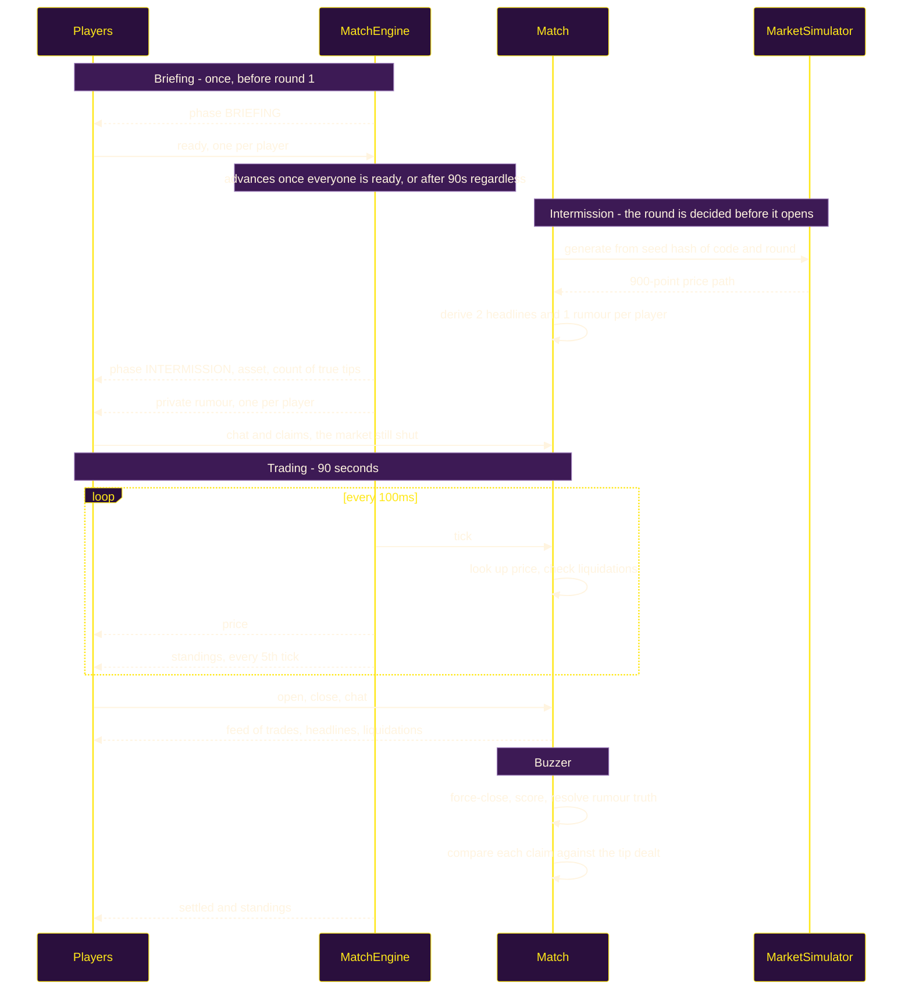
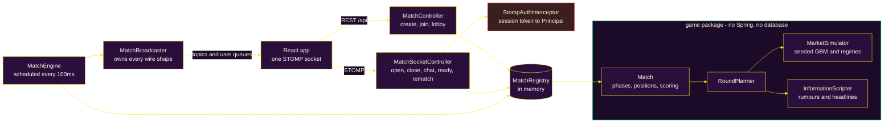

<div align="center">
  
</div>

# Stonk Royale

Stonk Royale is a **nine-minute multiplayer trading game built around deception rather than
finance**. Five rounds, one fictional asset per round, and every player is privately dealt a
rumour about it — roughly 40% of which are true. You are never told which kind you got. The
room is told how many true ones are out there.

Think skribbl.io, but instead of drawing you're going 10x long on `$BAGZ` while someone in
chat swears their tip says it's about to rug.

The whole thing runs in memory as a single JAR. There is no database to provision, no
account to create, and no market data feed to depend on.

---

## What it does

- **Nobody signs up.** A player types a nickname and is in. Joining returns a session token
  that authenticates every later socket message, so guests get real identity without an
  account. Firebase sign-in exists, is entirely optional, and is absent from the UI unless
  configured — a login wall is the single biggest reason someone never tries a browser game.

- **The market is simulated, not live.** Prices come from seeded geometric Brownian motion
  under a hidden per-round regime, tuned so ninety seconds covers a **30–50% range**. Real
  crypto moves well under 1% in that window, which would cluster every final score within a
  fraction of a percent of the last.

- **The server knows how each round ends before it starts.** The full 900-point price path
  is generated during the intermission. That's what lets a "true" rumour be genuinely true,
  and lets a warning headline land 2–4 seconds _before_ the crash it warns about.

- **The room's own trading moves the price too.** Every open, close and forced liquidation
  gives the price a shove that fades over a few seconds — transient, never permanent, and
  never able to change the round's hidden fate by itself. The seeded path is the tide; the
  room is the chop on top of it. Six players piling into the same side together can push
  price by several percent, and a liquidation is a forced sell like any other, which is how
  a cascade can take a table down together without any special-case code for it.

- **Cash resets every round.** Each round starts every player at the same $10,000 and scores
  that round's PnL independently. A blowup in round one costs that round and nothing else —
  carrying losses forward would leave a player dead for eight minutes, which is the moment
  people close the tab.

- **Liquidation is not elimination.** Breaching maintenance margin costs exactly 90% of
  posted margin, leaving 10% to re-enter with. Combined with the per-round reset, no player
  is ever left with nothing to do.

- **Chat is a mechanic, not decoration.** Because every player holds a different tip of
  unknown truth, comparing notes is genuinely useful and lying is genuinely profitable.
  News, trades, chat and liquidations all share one feed, so a headline and a player's lie
  arrive looking equally credible.

- **The room is told how many tips are true, but not whose.** A count of one against four
  people all claiming a pump means three of them are lying where everyone can see it. Every
  round holds **at least one** true tip — a round with none gives the table nothing to check
  a claim against, and decays into a coin flip.

- **What you know stays on screen.** The tip, the true-tip count and every headline that has
  fired sit in a dossier beside the chart for the whole round. Exactly one headline per round
  is true and one is false, so a single one is a coin flip — pinning them is what lets you
  read them as a contradicting pair. A tip also names the regime it claims, because decoding
  flavour prose into a trading stance is not the interesting part of the decision.

- **Lying goes on the record.** Quick-chat lines carry a structured claim, and at the settle
  each one is shown next to the tip that player was actually dealt. That mismatch is the only
  dishonesty a server can prove; free text stays unparsed and unscored. Catching someone
  **pays nothing** — this is a party game, and the payoff is social, not numerical.

- **Sound with no assets.** Countdown ticks, a liquidation buzz, a settle chime and a finish
  fanfare are synthesised through the Web Audio API rather than shipped as files, so nothing
  is downloaded and nothing is licensed. Mute persists across sessions.

- **The underlying market is deterministic and replayable.** Everything derives from the
  match code and round number, so the same code replays the same seeded path exactly — any
  bug is reproducible from its code alone. What the room does on top of that path is not
  replayed: order flow (see above) means a rematch rides the same tide, and the difference
  is entirely what the table did to it.

---

## How a match plays

|               | Default                    | Host can set |
| ------------- | -------------------------- | ------------ |
| Rounds        | 5                          | 1–8          |
| Round length  | 90 seconds                 | 10–180s      |
| Intermission  | 25 seconds                 | 5–60s        |
| Starting cash | $10,000, reset every round | see below    |
| Players       | 12 max                     | 2–12         |
| Total         | ~10 minutes                |              |

The host picks these before starting, either with a preset — **Quick** (3×60s), **Standard**
(5×90s) or **Long** (7×90s) — or from individual dials behind an _Advanced settings_
toggle, which shows the estimated match length as you move them.

The host keeps those controls in the room itself: **Change match settings** retunes rounds,
length, intermission, seats and starting cash from the lobby, and the change is broadcast to
everyone waiting. Settings lock the moment the match starts. A host can also clear a seat
with the ✕ beside a player's name — that frees the slot but is not a ban, since the room
code still works.

Rounds cap at 8 because a match never repeats an asset. Starting cash is **cosmetic**:
scoring is a percentage of it, so changing it alters the numbers on screen and nothing
about the outcome. The UI says so plainly rather than letting hosts mistake it for a
difficulty setting.

Bounds are enforced server-side in `MatchConfig`, not just in the UI — the create endpoint
is public, and without an upper bound a crafted request could ask for a 24-hour round.

Before the first round, the room sits in a **Briefing**: a scrollable rules panel that
won't unlock its Ready button until you've actually scrolled to the end. Everyone has to
ready up before play begins, but a 90-second failsafe starts it anyway — one player
wandering off shouldn't be able to stall the whole table indefinitely. Anyone who has read
the briefing before on this browser skips straight to a waiting screen.

A dropped socket is treated differently depending on when it happens. In the lobby it frees
the seat immediately, so someone who closes their window and comes back does not leave a
ghost behind holding a slot. Mid-match the seat is kept — phones lock their screens
constantly and the client reconnects — but a player whose socket is down no longer holds the
briefing gate shut for everyone else.

Each round cycles through three beats:

1. **Intermission.** The next asset is revealed with its blurb, every player is dealt a
   private rumour, and the room is told how many of those rumours are true. The round just
   finished is scored, your previous card comes back stamped **TRUE** or **LIE**, and a
   ledger shows what each player said their tip was against what they actually held. The
   wire is open throughout — this is the negotiation phase, so it is the one beat where you
   can talk without a moving market to watch.
2. **Trading.** Long or short, 1x–10x leverage, adjustable size. One position at a time.
   Your liquidation price is drawn on the chart, because leverage should be a legible
   decision rather than a hidden trapdoor. The dossier keeps your tip, the true-tip count
   and the round's headlines beside it, so the information you were dealt is still there
   when you act on it. Big trades — yours and everyone else's — push the price themselves,
   briefly, so a crowded trade is a real, visible force in the room.
3. **Settle.** Open positions force-close at the buzzer, scores are added to the running
   total, and the regime is revealed — next to what your tip claimed, so you find out
   whether trusting it was the right call.

Highest cumulative score across all rounds wins, ties broken on best single round. The final
round has no intermission behind it, so its ledger appears on the results screen instead.

When it's over the room stays open. **Play again** keeps every seat, code and setting on a
fresh market; **Rerun the same market** replays the identical seeded price paths — the tide
is the same, so whatever's different the second time is down to how the table traded it, not
the market getting lucky or unlucky again. Returning to the lobby rather than straight into
a round is also the only window in which someone new can join.

Arriving alone is not a dead end: **one round on your own** starts a solo practice match
immediately, so an unaccompanied visitor still sees the game rather than a lobby that needs a
second player.

---

## Architecture

### Round lifecycle



### Components



The `game` package has no Spring annotations and no persistence anywhere in it. `Match.tick(now)`
takes a timestamp and returns what happened, so an entire five-round match runs in a unit
test in a fraction of a second by passing invented timestamps — no waiting out real rounds.

---

## The simulated market

Each round runs one hidden regime. Measured over 2,000 seeded paths each:

| Regime    | Shape                     | Median range | Median return | 10th pct | 90th pct |
| --------- | ------------------------- | ------------ | ------------- | -------- | -------- |
| `PUMP`    | Steady upward drift       | 38.7%        | +27.7%        | +0.5%    | +61.0%   |
| `DUMP`    | Steady bleed              | 31.4%        | −22.6%        | −39.0%   | −2.4%    |
| `CHOP`    | No drift, high volatility | 43.3%        | −2.7%         | −34.7%   | +43.1%   |
| `RUG`     | Grinds up, then −40%      | 51.9%        | −26.9%        | −40.1%   | −11.3%   |
| `SQUEEZE` | Slow bleed, then +40%     | 45.1%        | +20.2%        | −1.5%    | +45.8%   |

No regime is a free win — `PUMP`'s 10th percentile is roughly flat, so reading the round
correctly still doesn't excuse bad timing.

Leverage liquidates on an adverse move of `0.9 / leverage`. What keeps high leverage a real
choice rather than a trap is that survival depends on **hold length**, not the round's full
range:

| Hold | 2x   | 3x  | 5x  | 10x |
| ---- | ---- | --- | --- | --- |
| 10s  | 100% | 98% | 96% | 82% |
| 20s  | 100% | 94% | 89% | 65% |
| 30s  | 99%  | 91% | 78% | 55% |
| 45s  | 98%  | 84% | 69% | 44% |

10x is a viable scalping tool and close to a coinflip if you hold it; 2x will sit through a
whole round. Leverage becomes a statement about your time horizon.

---

## Running it locally

Requires **Java 26** (set by `<java.version>` in `backend/pom.xml`) and **Node 18+**. There
is nothing else to install and nothing to
configure — no database, no API keys, no market data account.

```bash
# terminal 1 — backend on :8080
cd backend && ./mvnw spring-boot:run

# terminal 2 — frontend on :5173, proxies /api (sockets included) to the backend
cd frontend && npm install && npm run dev
```

Open <http://localhost:5173>, enter a nickname, and hit **Start a game**. Open the invite
link in a second browser profile or an incognito window to play both sides — seats are keyed
per match in `sessionStorage`, so two normal tabs in the same profile will share one seat.

### Playtesting faster

A full match is ten minutes, which is slow when you're iterating. The create endpoint takes
optional overrides:

```bash
curl -X POST localhost:5173/api/match \
  -H 'Content-Type: application/json' \
  -d '{"nickname":"alice","rounds":2,"roundSeconds":20,"intermissionSeconds":5}'
```

That returns a `code`; open `http://localhost:5173/m/CODE` to join it. A 2-round, 20-second
match finishes in about a minute and still exercises every phase, both rumour beats, and the
stamp reveal.

### Single JAR

To run exactly what the container would, without Docker:

```bash
cd frontend && npm run build
rm -rf ../backend/src/main/resources/static      # not optional — see below
cp -r dist ../backend/src/main/resources/static
cd ../backend && ./mvnw -DskipTests package
java -jar target/backend-0.0.1-SNAPSHOT.jar      # everything on :8080
```

The copy is the step that is easy to skip, and skipping it fails quietly: `mvnw package`
knows nothing about `frontend/`, so the JAR builds happily with no `index.html` in it and
every page returns 404 while the log looks perfectly healthy.

Two things that bite on a second run:

- `cp -r dist static` only creates `static/` the first time. Run it again without the `rm`
  and you get `static/dist/`, which serves nothing. Hence the `rm -rf`.
- **Stop any running instance before repackaging.** On Windows the running JVM locks the
  JAR, `spring-boot:repackage` cannot rename it, and the build leaves a *plain* jar in
  `target/` that `java -jar` will refuse to start.

The frontend calls `/api` relatively, so the same build serves both from one origin with no
CORS to configure. `docker compose up` does these steps in a multi-stage build, though that
layer has never actually been run — the equivalent arrangement was verified by hand.

`docker-compose.yml` fronts the app container with Caddy, which terminates TLS for a real
domain (edit the hostname in `Caddyfile`, point an A record at the host, and Caddy handles
the certificate via Let's Encrypt automatically — no manual cert setup). The app container
itself is no longer published on the host; only Caddy's `80`/`443` are, so open those in the
droplet firewall instead of `8080`. `ALLOWED_ORIGINS` in the compose file is locked to that
domain's `https://` origin rather than `*`, since the browser's Clipboard API (used by the
lobby's invite-link copy button) also refuses to run outside a secure context — plain
`http://ip:8080` access silently can't copy to the clipboard for this reason.

---

## Configuration

Everything is optional and the defaults are the intended experience.

| Variable                    | Where    | Default | What it does                                       |
| --------------------------- | -------- | ------- | -------------------------------------------------- |
| `PORT`                      | backend  | `8080`  | Port to serve on                                   |
| `ALLOWED_ORIGINS`           | backend  | `*`     | Comma-separated origin patterns for API and socket |
| `VITE_API_URL`              | frontend | `/api`  | Only set this if the API is on a different host    |
| `VITE_FIREBASE_API_KEY`     | frontend | unset   | Enables the optional sign-in button                |
| `VITE_FIREBASE_AUTH_DOMAIN` | frontend | unset   | Firebase auth domain                               |
| `VITE_FIREBASE_PROJECT_ID`  | frontend | unset   | Firebase project id                                |
| `VITE_FIREBASE_APP_ID`      | frontend | unset   | Firebase app id                                    |

Firebase values are web config, which is public by design. Drop a `serviceAccount.json` into
`backend/src/main/resources/` to let the backend verify those tokens; without it the bean is
absent and the server runs guest-only. See [`frontend/.env.example`](frontend/.env.example).

> A signed-in player gets a **stable id across matches**, but nothing is stored anywhere —
> persistent stats would need a database, which the project deliberately does not have.

---

## Repository layout

```text
stonk-royale/
├── backend/
│   └── src/main/java/com/pushkqr/springBackend/
│       ├── game/                  # no Spring, no persistence — the whole game
│       │   ├── Match.java         # phases, tick loop, scoring, standings
│       │   ├── RoundPlanner.java  # asset + regime + path + rumours from a seed
│       │   ├── sim/               # Regime, PricePath, MarketSimulator
│       │   ├── info/              # Rumor, MarketEvent, NewsCopy, InformationScripter
│       │   └── model/             # Position, PlayerRound, Asset, MatchConfig
│       ├── server/                # STOMP + REST wiring
│       │   ├── MatchEngine.java   # @Scheduled 100ms clock for every live match
│       │   ├── MatchBroadcaster.java  # every topic name and wire shape
│       │   ├── Views.java         # deliberately narrower than the game model
│       │   └── StompAuthInterceptor.java
│       └── config/                # security, websocket, optional Firebase, SPA fallback
│
├── frontend/src/
│   ├── components/       # Trading, Intermission, Results, RumorCard, PriceChart,
│   │                     #   Wire, Ledger, Standings, Dossier, MatchSettings,
│   │                     #   MuteToggle, Briefing, RulesContent, RulesTab
│   ├── state/            # MatchProvider — owns the socket and all match state
│   ├── lib/              # api, session, format, regime, auth, sound, matchSettings, briefing, useCountdown
│   └── styles/           # tokens in index.css, screens in game.css
│
├── Dockerfile            # multi-stage: frontend build folded into the JAR
├── docker-compose.yml    # app + Caddy (automatic HTTPS reverse proxy)
└── Caddyfile
```

`Views.java` exists because the game model is dangerous to serialise: a `Rumor` carries
whether it is truthful and a `RoundPlan` carries the entire future price path. Neither may
reach a client mid-round.

---

## Testing

```bash
cd backend && ./mvnw test
```

127 tests, all passing. They assert **design targets rather than implementation details**:

- `RUG` actually crashes and `SQUEEZE` actually spikes, measured across 400 seeds
- `CHOP` has no directional bias
- Every regime clears the volatility bar that makes a round watchable
- Rumour wording is **identical** for truths and lies, so phrasing can never leak which you got
- A lie can land in the same time window as a shock warning, so timing can't leak it either
- Cash really does reset between rounds, and a liquidated player can trade again
- The same match code replays an identical seeded path
- Every round holds at least one true tip, across 500 seeds — and the count still varies,
  because a number that never changes would stop being information
- The announced count always matches the tips actually dealt
- A claim made in the intermission survives into the round; one made in the lobby does not,
  and none of them leak into the next round

> **The socket layer has no automated tests.** `MatchEngine`, `MatchBroadcaster`,
> `MatchSocketController` and `StompAuthInterceptor` were verified by driving a real headless
> browser and a scripted STOMP client against a running server — host-only start, per-player
> rumour delivery, liquidation broadcasts, error routing, the Vite dev proxy, and the packaged
> JAR. That caught real bugs, but it is a manual check that does not run in CI. Turning it
> into an automated integration test is the most valuable outstanding work in the repo.

---

## Disclaimer

Every asset in this game is fictional, every price is generated by a random number
generator, and all the money is imaginary. It is a party game about lying to your friends.
Nothing here is investment advice, and none of it resembles how real markets behave.
