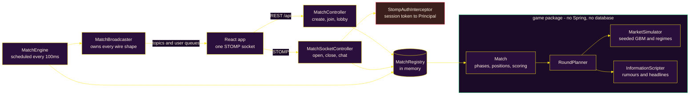

<div align="center">
  
</div>

# Stonk Royale

Stonk Royale is a **nine-minute multiplayer trading game built around deception rather than
finance**. Five rounds, one fictional asset per round, and every player is privately dealt a
rumour about it — roughly 40% of which are true, and nobody is told which kind they got.

Think skribbl.io, but instead of drawing you're going 10x long on `$BAGZ` while someone in
chat swears their tip says it's about to rug.

The whole thing runs in memory as a single JAR. There is no database to provision, no
account to create, and no market data feed to depend on.

---

## What it does

- **Nobody signs up.** A player types a nickname and is in. Joining returns a session token
  that authenticates every later socket message, so guests get real identity without an
  account. Firebase sign-in exists, is entirely optional, and is absent from the UI unless
  configured — a login wall is the single biggest reason someone never tries a browser game.

- **The market is simulated, not live.** Prices come from seeded geometric Brownian motion
  under a hidden per-round regime, tuned so ninety seconds covers a **30–50% range**. Real
  crypto moves well under 1% in that window, which would cluster every final score within a
  fraction of a percent of the last.

- **The server knows how each round ends before it starts.** The full 900-point price path
  is generated during the intermission. That's what lets a "true" rumour be genuinely true,
  and lets a warning headline land 2–4 seconds _before_ the crash it warns about.

- **Cash resets every round.** Each round starts every player at the same $10,000 and scores
  that round's PnL independently. A blowup in round one costs that round and nothing else —
  carrying losses forward would leave a player dead for eight minutes, which is the moment
  people close the tab.

- **Liquidation is not elimination.** Breaching maintenance margin costs exactly 90% of
  posted margin, leaving 10% to re-enter with. Combined with the per-round reset, no player
  is ever left with nothing to do.

- **Chat is a mechanic, not decoration.** Because every player holds a different tip of
  unknown truth, comparing notes is genuinely useful and lying is genuinely profitable.
  News, trades, chat and liquidations all share one feed, so a headline and a player's lie
  arrive looking equally credible.

- **Deterministic and replayable.** Everything derives from the match code and round number,
  so the same code replays the same market exactly — a rematch is a fair comparison and any
  bug is reproducible from its code alone.

---

## How a match plays

|               | Default                    | Host can set |
| ------------- | -------------------------- | ------------ |
| Rounds        | 5                          | 1–8          |
| Round length  | 90 seconds                 | 10–300s      |
| Intermission  | 15 seconds                 | —            |
| Starting cash | $10,000, reset every round | see below    |
| Players       | 12 max                     | 2–12         |
| Total         | ~9 minutes                 |              |

The host picks these before starting, either with a preset — **Quick** (3×60s), **Standard**
(5×90s) or **Long** (7×90s) — or from individual dials behind an _Advanced settings_
toggle, which shows the estimated match length as you move them.

Rounds cap at 8 because a match never repeats an asset. Starting cash is **cosmetic**:
scoring is a percentage of it, so changing it alters the numbers on screen and nothing
about the outcome. The UI says so plainly rather than letting hosts mistake it for a
difficulty setting.

Bounds are enforced server-side in `MatchConfig`, not just in the UI — the create endpoint
is public, and without an upper bound a crafted request could ask for a 24-hour round.

Each round cycles through three beats:

1. **Intermission.** The next asset is revealed with its blurb, and every player is dealt a
   private rumour. The round just finished is scored, and your previous card comes back
   stamped **TRUE** or **LIE**.
2. **Trading.** Long or short, 1x–10x leverage, adjustable size. One position at a time.
   Your liquidation price is drawn on the chart, because leverage should be a legible
   decision rather than a hidden trapdoor.
3. **Settle.** Open positions force-close at the buzzer, scores are added to the running
   total, and the regime is revealed.

Highest cumulative score across all rounds wins, ties broken on best single round.

---

## Architecture

### Round lifecycle


### Components



The `game` package has no Spring annotations and no persistence anywhere in it. `Match.tick(now)`
takes a timestamp and returns what happened, so an entire five-round match runs in a unit
test in a fraction of a second by passing invented timestamps — no waiting out real rounds.

---

## The simulated market

Each round runs one hidden regime. Measured over 2,000 seeded paths each:

| Regime    | Shape                     | Median range | Median return | 10th pct | 90th pct |
| --------- | ------------------------- | ------------ | ------------- | -------- | -------- |
| `PUMP`    | Steady upward drift       | 38.7%        | +27.7%        | +0.5%    | +61.0%   |
| `DUMP`    | Steady bleed              | 31.4%        | −22.6%        | −39.0%   | −2.4%    |
| `CHOP`    | No drift, high volatility | 43.3%        | −2.7%         | −34.7%   | +43.1%   |
| `RUG`     | Grinds up, then −40%      | 51.9%        | −26.9%        | −40.1%   | −11.3%   |
| `SQUEEZE` | Slow bleed, then +40%     | 45.1%        | +20.2%        | −1.5%    | +45.8%   |

No regime is a free win — `PUMP`'s 10th percentile is roughly flat, so reading the round
correctly still doesn't excuse bad timing.

Leverage liquidates on an adverse move of `0.9 / leverage`. What keeps high leverage a real
choice rather than a trap is that survival depends on **hold length**, not the round's full
range:

| Hold | 2x   | 3x  | 5x  | 10x |
| ---- | ---- | --- | --- | --- |
| 10s  | 100% | 98% | 96% | 82% |
| 20s  | 100% | 94% | 89% | 65% |
| 30s  | 99%  | 91% | 78% | 55% |
| 45s  | 98%  | 84% | 69% | 44% |

10x is a viable scalping tool and close to a coinflip if you hold it; 2x will sit through a
whole round. Leverage becomes a statement about your time horizon.

---

## Running it locally

Requires **Java 26** (set by `<java.version>` in `backend/pom.xml`) and **Node 18+**. There
is nothing else to install and nothing to
configure — no database, no API keys, no market data account.

```bash
# terminal 1 — backend on :8080
cd backend && ./mvnw spring-boot:run

# terminal 2 — frontend on :5173, proxies /api (sockets included) to the backend
cd frontend && npm install && npm run dev
```

Open <http://localhost:5173>, enter a nickname, and hit **Start a game**. Open the invite
link in a second browser profile or an incognito window to play both sides — seats are keyed
per match in `sessionStorage`, so two normal tabs in the same profile will share one seat.

### Playtesting faster

A full match is nine minutes, which is slow when you're iterating. The create endpoint takes
optional overrides:

```bash
curl -X POST localhost:5173/api/match \
  -H 'Content-Type: application/json' \
  -d '{"nickname":"alice","rounds":2,"roundSeconds":20}'
```

That returns a `code`; open `http://localhost:5173/m/CODE` to join it. A 2-round, 20-second
match finishes in about a minute and still exercises every phase, both rumour beats, and the
stamp reveal.

### Single JAR

To run exactly what the container would, without Docker:

```bash
cd frontend && npm run build
cp -r dist ../backend/src/main/resources/static
cd ../backend && ./mvnw -DskipTests package
java -jar target/backend-0.0.1-SNAPSHOT.jar     # everything on :8080
```

The frontend calls `/api` relatively, so the same build serves both from one origin with no
CORS to configure. `docker compose up` does these steps in a multi-stage build — see the
caveat under [Known gaps](#known-gaps).

---

## Configuration

Everything is optional and the defaults are the intended experience.

| Variable                    | Where    | Default | What it does                                       |
| --------------------------- | -------- | ------- | -------------------------------------------------- |
| `PORT`                      | backend  | `8080`  | Port to serve on                                   |
| `ALLOWED_ORIGINS`           | backend  | `*`     | Comma-separated origin patterns for API and socket |
| `VITE_API_URL`              | frontend | `/api`  | Only set this if the API is on a different host    |
| `VITE_FIREBASE_API_KEY`     | frontend | unset   | Enables the optional sign-in button                |
| `VITE_FIREBASE_AUTH_DOMAIN` | frontend | unset   | Firebase auth domain                               |
| `VITE_FIREBASE_PROJECT_ID`  | frontend | unset   | Firebase project id                                |
| `VITE_FIREBASE_APP_ID`      | frontend | unset   | Firebase app id                                    |

Firebase values are web config, which is public by design. Drop a `serviceAccount.json` into
`backend/src/main/resources/` to let the backend verify those tokens; without it the bean is
absent and the server runs guest-only. See [`frontend/.env.example`](frontend/.env.example).

> A signed-in player gets a **stable id across matches**, but nothing is stored anywhere —
> persistent stats would need a database, which the project deliberately does not have.

---

## Repository layout

```text
stonk-royale/
├── backend/
│   └── src/main/java/com/pushkqr/springBackend/
│       ├── game/                  # no Spring, no persistence — the whole game
│       │   ├── Match.java         # phases, tick loop, scoring, standings
│       │   ├── RoundPlanner.java  # asset + regime + path + rumours from a seed
│       │   ├── sim/               # Regime, PricePath, MarketSimulator
│       │   ├── info/              # Rumor, MarketEvent, NewsCopy, InformationScripter
│       │   └── model/             # Position, PlayerRound, Asset, MatchConfig
│       ├── server/                # STOMP + REST wiring
│       │   ├── MatchEngine.java   # @Scheduled 100ms clock for every live match
│       │   ├── MatchBroadcaster.java  # every topic name and wire shape
│       │   ├── Views.java         # deliberately narrower than the game model
│       │   └── StompAuthInterceptor.java
│       └── config/                # security, websocket, optional Firebase, SPA fallback
│
├── frontend/src/
│   ├── components/       # Trading, Intermission, RumorCard, PriceChart, Wire, Standings
│   ├── state/            # MatchProvider — owns the socket and all match state
│   ├── lib/              # api, session, format, auth, useCountdown
│   └── styles/           # tokens in index.css, screens in game.css
│
├── Dockerfile            # multi-stage: frontend build folded into the JAR
└── docker-compose.yml
```

`Views.java` exists because the game model is dangerous to serialise: a `Rumor` carries
whether it is truthful and a `RoundPlan` carries the entire future price path. Neither may
reach a client mid-round.

---

## Testing

```bash
cd backend && ./mvnw test
```

74 tests, all passing. They assert **design targets rather than implementation details**:

- `RUG` actually crashes and `SQUEEZE` actually spikes, measured across 400 seeds
- `CHOP` has no directional bias
- Every regime clears the volatility bar that makes a round watchable
- Rumour wording is **identical** for truths and lies, so phrasing can never leak which you got
- A lie can land in the same time window as a shock warning, so timing can't leak it either
- Cash really does reset between rounds, and a liquidated player can trade again
- The same match code replays an identical market

> **The socket layer has no automated tests.** `MatchEngine`, `MatchBroadcaster`,
> `MatchSocketController` and `StompAuthInterceptor` were verified by driving a real headless
> browser and a scripted STOMP client against a running server — host-only start, per-player
> rumour delivery, liquidation broadcasts, error routing, the Vite dev proxy, and the packaged
> JAR. That caught real bugs, but it is a manual check that does not run in CI. Turning it
> into an automated integration test is the most valuable outstanding work in the repo.

---

## Known gaps

- **`docker compose up` has never been run.** The equivalent arrangement was built and
  verified by hand — frontend compiled into the JAR's static resources, single port, invite
  links resolving on cold load — but the Docker layer itself is untested. Try it before
  relying on it.
- **The tuning is measured, not playtested.** 90-second rounds, 40% true rumours, and
  15-second intermissions are all reasoned from the distributions above. Whether the
  intermission drags or the rounds feel rushed can only come from real games.
- **Nothing survives a restart.** Every match in progress is lost. Finished matches are
  reaped 5 minutes after ending so the standings can be read.
- **A player who leaves mid-match keeps their seat**, and their score, so standings stay
  stable. There is no way to drop them.

---

## Disclaimer

Every asset in this game is fictional, every price is generated by a random number
generator, and all the money is imaginary. It is a party game about lying to your friends.
Nothing here is investment advice, and none of it resembles how real markets behave.
