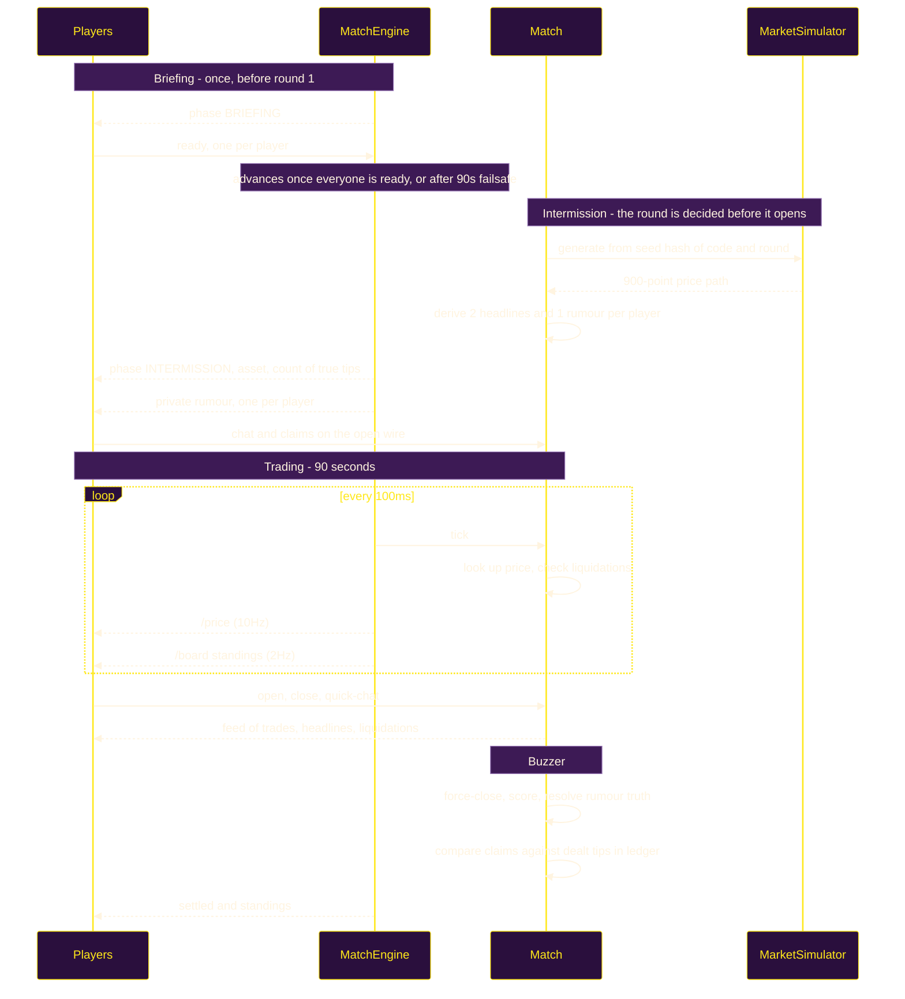
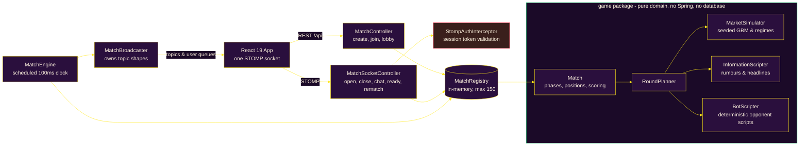

<div align="center">
  
</div>

# Stonk Royale

Stonk Royale is a **nine-minute multiplayer trading game built around deception rather than finance**. Five rounds, one fictional asset per round, and every player is privately dealt a rumour about it — roughly 40% of which are true. You are never told which kind you got. The room is told how many true ones are out there.

Think skribbl.io, but instead of drawing you're going 10x long on `$BAGZ` while someone in chat swears their tip says it's about to rug.

The entire stack runs in-memory as a single JAR on **Spring Boot 4.1 / Java 26** with a **React 19 / Vite** client over WebSocket STOMP. There is no database to provision, no user accounts to manage, and no live market data feeds to depend on.

---

## Core Pillars

- **Zero-Friction Access:** No accounts or logins required. Entering a nickname issues a cryptographically authenticated session token for WebSocket messaging. Optional Firebase authentication exists without UI clutter unless configured.
- **Public & Quick Matchmaking:** Rooms default to private codes. Hosts can toggle public discovery, and Quick Match instantly places solo players into waiting rooms or provisions bot-filled lobbies to prevent dead ends.
- **Resilient Seat Lifecycle:** Disconnected sockets in the lobby or results screen receive a 45-second grace window before seat recycling. Mid-match leaves permanently retire the seat (preserving leaderboard scores while freeing capacity for latecomers).
- **Precomputed Seeded Markets:** Prices evolve via seeded Geometric Brownian Motion (GBM) precalculated during intermissions, ensuring rumours are verifiably true and breaking news headlines appear 2–4s before price shocks.
- **Transient Order Flow Impact:** Player orders and liquidation margin calls push prices dynamically with a 4.0s exponential decay ($\tau = 4.0\text{s}$), clamping at $\pm 4\%$ to create realistic market chop without altering baseline regime truths.
- **Autonomous Practice Bots:** Solo mode features deterministic scripted opponent bots (`SHARP`, `MARK`, `CHOPPER`) that trade, react to news in chat, and bluff on the end-of-round social ledger.
- **Near-Zero-Asset Web Audio:** Game countdowns, victory fanfares and every other cue are procedurally synthesized at runtime via the Web Audio API. The one exception is the liquidation sting, a 33kB sample fetched once and cached; nothing else is downloaded.

---

## System Architecture

### Round Lifecycle



### Component Architecture



---

## Deep-Dive Learning Guides

For comprehensive technical, mathematical, and architectural documentation, explore the dedicated learning guides:

- **[01. Gameplay Loop & Deception Mechanics](learning/01-gameplay-and-deception.md)**  
  *Match configuration, briefing gate, rumour deals, headline shock lead times, structured wire claims, and zero-point social scoring philosophy.*
- **[02. Market Simulation & Order Flow Impact](learning/02-market-and-order-flow.md)**  
  *Seeded GBM mathematics, 5 empirical regime tables, decaying order flow impact formulas ($\tau = 4.0\text{s}$), liquidation cascades, and margin survival statistics.*
- **[03. Backend Architecture & The 100ms Tick Engine](learning/03-backend-architecture.md)**  
  *Spring-free domain model, deterministic timestamp injection, unified 100ms scheduler, `TickMeter` telemetry, STOMP wire isolation (`Views.java`), and broker defenses.*
- **[04. Practice Bots & Deterministic Scripting](learning/04-bots-and-simulation.md)**  
  *Solo mode design rationale, deterministic authoring in `BotScripter.java`, `SHARP`/`MARK`/`CHOPPER` personas, persona rotation, liar bots, and reactive chatter.*
- **[05. Frontend Architecture, 60fps Chart Rendering & Seat Lifecycle](learning/05-frontend-and-lifecycle.md)**  
  *React 19 state model, in-place `{ points, count }` buffer eliminating GC frame drops, 45s disconnect grace windows, seat retirement, and Web Audio API synthesis.*

---

## Quickstart & Local Setup

### Prerequisites
- **Java 26** (specified by `<java.version>` in `backend/pom.xml`)
- **Node.js 18+** & **npm**

### Development Mode

```bash
# Terminal 1 — Backend on :8080
cd backend && ./mvnw spring-boot:run

# Terminal 2 — Frontend on :5173 (proxies /api and WebSockets to :8080)
cd frontend && npm install && npm run dev
```

Open <http://localhost:5173> in your browser, enter a nickname, and start a game. Open an incognito tab to play both sides locally.

### Fast Playtesting Overrides
Create a short 2-round, 20-second test match instantly via curl:

```bash
curl -X POST http://localhost:5173/api/match \
  -H 'Content-Type: application/json' \
  -d '{"nickname":"alice","rounds":2,"roundSeconds":20,"intermissionSeconds":5}'
```

### Production Single-JAR & Docker

```bash
# Build production bundle and package JAR
cd frontend && npm run build
rm -rf ../backend/src/main/resources/static
cp -r dist ../backend/src/main/resources/static
cd ../backend && ./mvnw -DskipTests package
java -jar target/backend-0.0.1-SNAPSHOT.jar # Serves full app on :8080
```

Deploying with Docker and automatic TLS via Caddy:
```bash
docker compose up -d --build
```

---

## Configuration

All configuration is optional and defaults to the standalone in-memory experience:

| Variable | Environment | Default | Description |
| :--- | :--- | :--- | :--- |
| `PORT` | Backend | `8080` | Port for HTTP and WebSocket server |
| `ALLOWED_ORIGINS` | Backend | `*` | Allowed CORS and WebSocket origin patterns |
| `ADMIN_PASSWORD` | Backend | unset | Password unlocking `/admin` telemetry panel |
| `STATS_FILE` | Backend | unset | File path for persistent lifetime counter statistics |
| `VITE_API_URL` | Frontend | `/api` | Base API URL if frontend is hosted separately |
| `VITE_FIREBASE_API_KEY` | Frontend | unset | Enables optional Firebase authentication |
| `VITE_FIREBASE_AUTH_DOMAIN` | Frontend | unset | Firebase authentication domain |
| `VITE_FIREBASE_PROJECT_ID` | Frontend | unset | Firebase project ID |
| `VITE_FIREBASE_APP_ID` | Frontend | unset | Firebase application ID |

---

## Repository Layout

```text
stonk-royale/
├── backend/
│   └── src/main/java/com/pushkqr/springBackend/
│       ├── game/                  # Pure domain model — no Spring, no database
│       │   ├── Match.java         # Roster, tick loop, phases, scoring, standings
│       │   ├── RoundPlanner.java  # Seeded generator for paths, rumours, and bot scripts
│       │   ├── bot/               # BotPersona, BotAction, BotScript, BotScripter, BotChatter
│       │   ├── sim/               # Regime, PricePath, MarketSimulator, MarketImpact
│       │   ├── info/              # Rumor, MarketEvent, NewsCopy, InformationScripter
│       │   └── model/             # Position, PlayerRound, Asset, MatchConfig
│       ├── server/                # STOMP + REST infrastructure
│       │   ├── MatchEngine.java   # @Scheduled 100ms tick clock for live matches
│       │   ├── MatchBroadcaster.java # WebSocket topic definitions and serializers
│       │   ├── Views.java         # Minimal client projection records
│       │   ├── Bots.java          # Bot seating and collision-free names
│       │   └── StompAuthInterceptor.java # Session token validation
│       ├── admin/                 # TickMeter telemetry and stats persistence
│       └── config/                # WebSocket, security, and SPA routing config
│
├── frontend/src/
│   ├── components/                # Trading, Briefing, Intermission, Results, Dossier, PriceChart, etc.
│   ├── state/                     # MatchProvider.jsx — owns socket and game state
│   ├── lib/                       # api, session, format, sound, briefing, useCountdown
│   └── styles/                    # index.css (tokens) and game.css (layouts & themes)
│
├── learning/                      # Deep-dive architectural & mechanical modules (01 to 05)
├── Dockerfile                     # Multi-stage production container build
├── docker-compose.yml             # Container configuration with Caddy reverse proxy
└── Caddyfile                      # Automatic HTTPS configuration
```

---

## Testing

```bash
cd backend && ./mvnw test
```

**190 unit tests, all passing.** Tests validate mathematical and behavioral targets rather than incidental implementation details:
- `RUG` plunges and `SQUEEZE` spikes reliably across 400 random seeds.
- `CHOP` displays zero directional bias over 400 seeds.
- Rumour phrasing is identical between truths and lies to prevent syntactic leakage.
- Seeded Geometric Brownian Motion paths reproduce identically given the same room code.
- Market impact decays exponentially ($\tau = 4.0\text{s}$) and liquidations trigger chain reactions.
- Disconnected seats survive 45-second grace periods, and leavers retire without breaking standings.
- Duplicate names are rejected case-insensitively across active players.
- Promoted hosts are dynamically recognized on the results screen for instant rematches.

---

## Disclaimer

Every asset in this game is fictional, every price trajectory is generated by a seeded pseudo-random number generator, and all currency is imaginary. Stonk Royale is a party game about deception and social deduction. Nothing here constitutes financial or investment advice.
