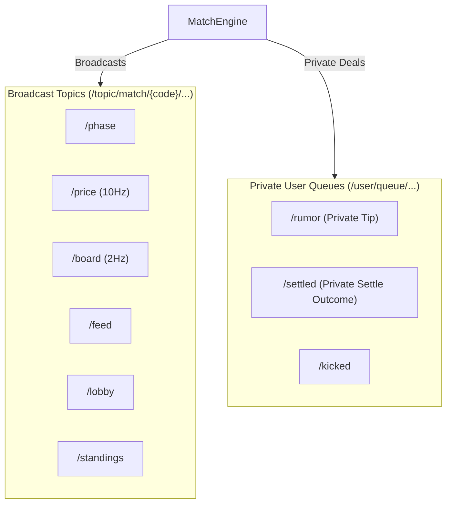

# Module 03: Backend Architecture & The 100ms Tick Engine

Stonk Royale's backend is designed around extreme determinism, memory efficiency, and frame-budget safety. The application runs as a single JAR on Spring Boot 4.1 / Java 26, holding all match state in-memory without an external database.

---

## 1. The Spring-Free Domain Model (`game/`)

The pure domain core (`com.pushkqr.springBackend.game`) is strictly isolated from Spring framework annotations and web concerns.

```
┌────────────────────────────────────────────────────────┐
│                   SERVER / WEB LAYER                   │
│   Spring Boot, WebSocket STOMP, REST Controllers, MVC   │
│   (MatchEngine, MatchBroadcaster, MatchController)     │
└───────────────────────────┬────────────────────────────┘
                            │ (Calls domain methods with timestamps)
                            ▼
┌────────────────────────────────────────────────────────┐
│                   PURE DOMAIN MODEL                    │
│   Zero Spring annotations, zero DB, pure Java objects   │
│   (Match, RoundPlanner, MarketSimulator, MarketImpact)  │
└────────────────────────────────────────────────────────┘
```

### Determinism Through Time Injection
No game logic calls `System.currentTimeMillis()` directly. Every state-advancing method (`tick`, `join`, `leave`, `openPosition`, `markConnected`) accepts an explicit `long now` parameter:
- **Instantaneous Unit Testing:** A complete 5-round, 10-minute match can be simulated in unit tests in **under 2 milliseconds** by advancing test timestamps in loop increments.
- **Reproducibility:** A match with a specific room code and timestamp progression executes identically in development, production, and test suites.

---

## 2. The 100ms Tick Loop (`MatchEngine.java`)

All active matches on the server advance on a single scheduled thread managed by `MatchEngine.java`:

```java
@Scheduled(fixedRate = 100)
public void tick() {
    long now = System.currentTimeMillis();
    for (Match match : registry.all()) {
        advance(match, now);
    }
}
```

### Tick Cadence & Frame Budgets
On every 100ms tick (`10Hz`), the engine:
1. Steps the price simulator and evaluates order flow decay.
2. Checks all open positions for maintenance margin breach and triggers liquidations.
3. Broadcasts `/price` updates to connected players in active trading rounds.
4. Broadcasts leaderboard updates (`/board`) every 5th tick (`2Hz`).

### Telemetry & The `TickMeter` Component
To guarantee the single-threaded engine never overruns its 100ms frame budget, `TickMeter.java` records the elapsed runtime of each tick loop:
- Maintains a 600-sample (60-second) rolling ring buffer.
- Calculates `worstMillis()` and `medianMillis()` in real time.
- Exposes cumulative lifetime overruns on the `/admin` telemetry panel.

### Registry Capacity (`MAX_LIVE_MATCHES = 150`)
On a standard 2 vCPU / 4 GB cloud droplet, CPU serialization and WebSocket outbound frames define the operational limit:
- ~100 concurrent rooms run with <15ms tick latency.
- `MatchRegistry` enforces a hard ceiling of **150 live matches**, returning an honest `409 Conflict` ("The server is busy — every room is in use. Try again in a minute.") rather than allowing new rooms to degrade existing live games.

---

## 3. STOMP Messaging Topology

Client communication occurs over a single WebSocket connection using the STOMP protocol.



### Topic & Queue Reference

| Destination | Cadence | Content |
| :--- | :--- | :--- |
| `/topic/match/{code}/phase` | On change | Phase transitions and phase expiration timestamps |
| `/topic/match/{code}/price` | 10Hz (100ms) | Current price, timestamp, and net market impact |
| `/topic/match/{code}/board` | 2Hz (500ms) | Lightweight table ranking and position telemetry |
| `/topic/match/{code}/feed` | Event-driven | Integrated stream of trades, news, and chat |
| `/topic/match/{code}/lobby` | On join/leave | Player roster, readiness, and host assignments |
| `/user/queue/rumor` | Intermission | Private rumour text, asset name, and asserted regime |
| `/user/queue/settled` | Round settle | Individual round PnL, rumor truth status, and regime |

---

## 4. Projection Isolation (`Views.java`)

Internal domain records contain sensitive future data (such as `RoundPlan.futurePath` and `Rumor.isTruthful`). To eliminate the possibility of client-side inspection cheats:
- Domain classes are **never directly serialized** over WebSocket or REST.
- `MatchBroadcaster.java` maps domain models to strict, minimal projection records defined in `Views.java`.
- A client inspecting incoming WebSocket frames can never see future prices, upcoming shock times, or the truth status of active rumours.

---

## 5. Network Optimization & Broker Defenses

1. **Desynchronized Board Flushes:**
   - Rather than all rooms flushing `/board` simultaneously on `ticks % 5 == 0`, flushes are staggered by room code hash:
     $$\text{Offset} = \text{floorMod}(\text{code.hashCode()},\, 5)$$
     $$\text{Board Due} \iff \text{floorMod}(\text{ticks} - \text{Offset},\, 5) = 0$$
   - This distributes JSON serialization evenly across the 100ms window.

2. **Suppression in Empty Rooms:**
   - Rooms with no connected humans stop emitting outbound frames entirely until a player reconnects, conserving server CPU and network bandwidth.

3. **Bidirectional Heartbeats & Slow-Client Protection:**
   - 10-second STOMP heartbeats detect severed mobile connections promptly.
   - `WebSocketConfig.java` bounds client outbound buffers to **256 KB** and **10 seconds stalled**. Sockets that fail to drain are disconnected, preserving the shared message broker.
